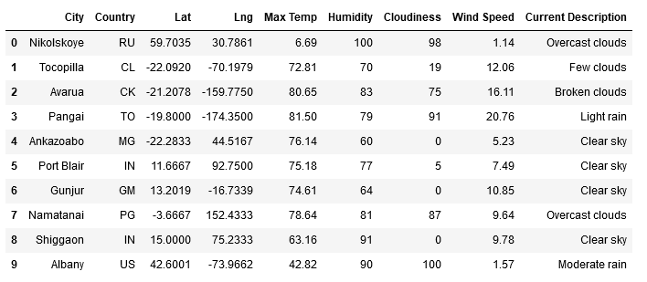
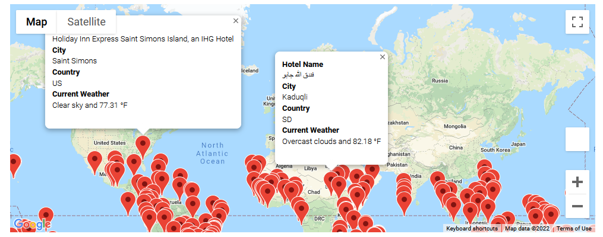
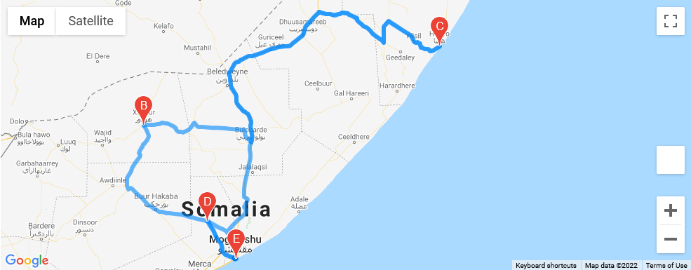

# World Weather Analysis

## Overview

This project uses Pandas, OpenWeather, CitiPy, and gmaps in order to collect and visualize weather data. After randomly selecting a large number of cities, they are filtered by weather characteristics, and a nearby hotel is found. Additionally, a selection of four cities is used to plot a possible trip route.
It is composed of three different parts:
* [Weather Database](#Weather-Database)
* [Vacation Seach](#Vacation-Search)
* [Vacation Itinerary](#Vacation-Itinerary)

## Weather Database

The [Weather Database](Weather_Database) uses NumPy to generate a set of longitude and latitude coordinates, and then uses CitiPy to find the nearest city to each coordinate. The current weather for the cities that were found is retrieved from OpenWeather using their API. The collection of cities and weather is transformed  into a Pandas DataFrame, and then exported to a csv file.

## Vacation Search

The [Vacation Search](Vacation_Search) uses our previously gathered weather data and gmaps to plot a collection of cities that have weather characteristics matching a traveler's preferences. Each location has an info box added that shows a brief description of the current weather. 

## Vacation Itinerary

The [Vacation Itinerary](Vacation_Itinerary) takes a selection of four cities matching the criteria in the vacation search, and, using gmaps, plots a route that visits all four, starting and ending at the first city. It also plots the four cities on a map with markers and info boxes, similar to the vacation search.
